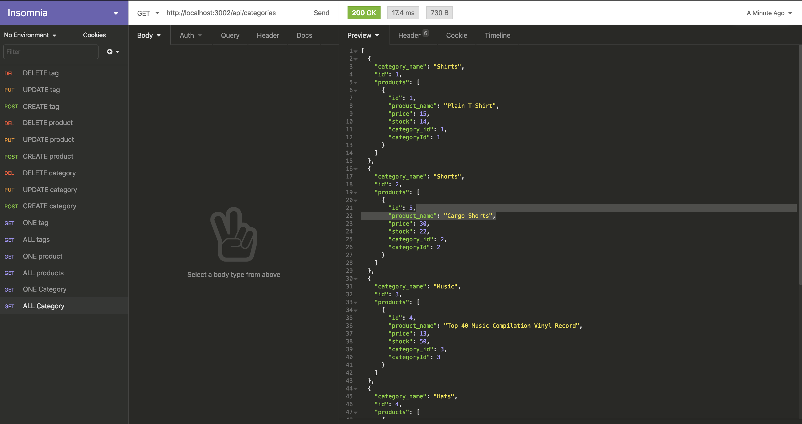

# E-commerce Back End 

## Walk-through Video
https://drive.google.com/file/d/1W3AFtCMbJIAg9U1fbBHit2KkRCYbJaur/view

## Screenshot

## User Story
AS A manager at an internet retail company
I WANT a back end for my e-commerce website that uses the latest technologies
SO THAT my company can compete with other e-commerce companies

## Description
Given a functional Express.js API, when the user adds their database name, MySQL username, and MySQL password to an environment variable file, they are able to connect to a database using Sequelize. When the user enters schema and seed commands, a development database is created and is seeded with test data. When the user enters the command to invoke the application, the server is started and the Sequelize models are synced to the MySQL database. When the user opens API GET routes in Insomnia Core for categories, products, or tags, the data for each of these routes is displayed in a formatted JSON. When the user tests API POST, PUT, and DELETE routes in Insomnia Core, they are able to successfully create, update, and delete data in the database

## Built With
* Node.js
* Express
* Sequelize
* Mysql2
* Dotenv
* Javascript

## License
This project is covered by ISC.

## Mallory Korpics https://github.com/mallynnk